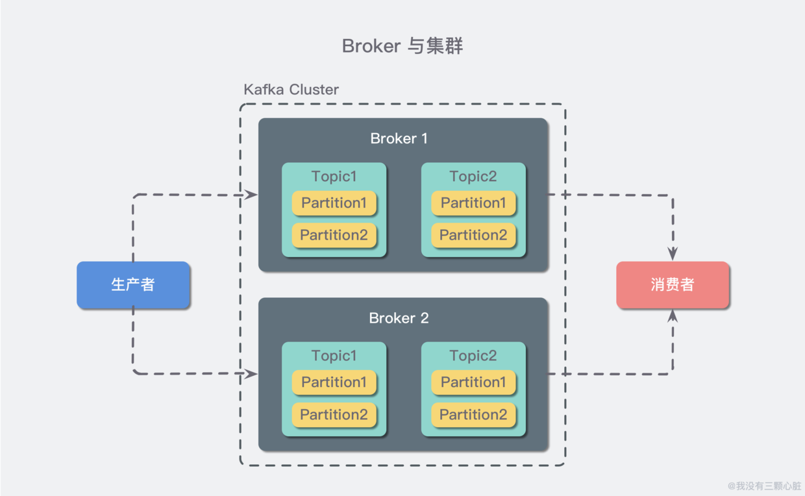
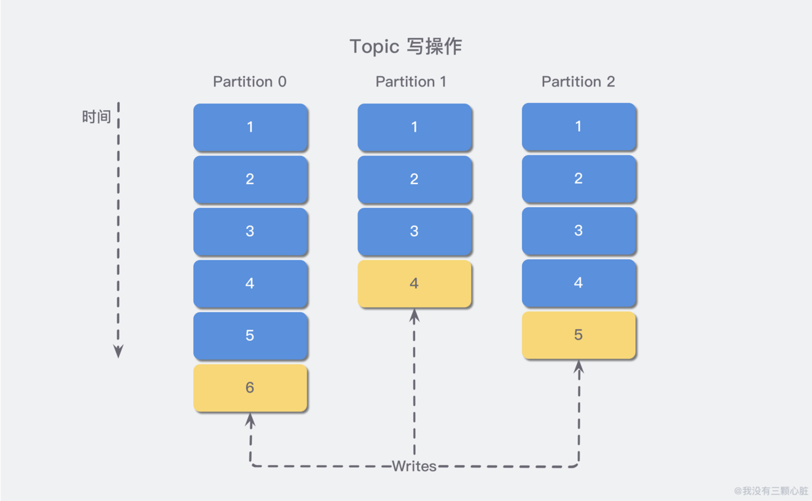
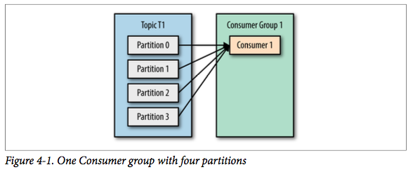

> 本文由 JavaGuide 读者推荐，JavaGuide 对文章进行了整理排版！原文地址：https://www.wmyskxz.com/2019/07/17/kafka-ru-men-jiu-zhe-yi-pian/ ， 作者：我没有三颗心脏。

# I. Introduction to Kafka

------

## Kafka create background

**Kafka** Is a messaging system originally developed from LinkedIn and used as the basis for LinkedIn's Activity Stream and Operational Data Processing Pipeline. Now it has been [Many different types of companies](https://cwiki.apache.org/confluence/display/KAFKA/Powered+By) Used as multiple types of data pipes and messaging systems.

**Activity stream data** It is the most common part of the data that almost all sites use when reporting on their site usage. Activity data includes page views, information about the content being viewed, and searches. This data is usually processed by first writing various activities to a file in the form of a log, and then performing statistical analysis on these files periodically. **Operational data** refers to server performance data (CPU, IO usage, request time, service log, etc.). There are many statistical methods for operating data.

In recent years, the processing of activity and operational data has become a vital part of the features of website software products, which requires a slightly more complex infrastructure to support it.

## Kafka Introduction

**Kafka is a distributed, publish / subscribe based messaging system.** 

The main design goals are as follows:

- Provides message persistence in a time complexity of O (1), and can guarantee constant time complexity access performance even for data above the terabyte level.
- High throughput. Even on very cheap commercial machines, it can achieve a single machine supporting transmission of more than 100K messages per second.
- Supports message partitioning and distributed consumption between Kafka Servers, while ensuring the sequential transmission of messages in each Partition.
- Supports both offline data processing and real-time data processing.
- Scale out: support online horizontal expansion.

## Kafka basic concepts

### Concept 1: producers and consumers


There are two basic types of clients for Kafka:

1. **Producer**
2. **Consumer**

In addition, there are high-level clients such as Kafka Connect API for data integration and Kafka Streams for streaming. However, these high-level clients are still the producer and consumer APIs at the bottom. They are just encapsulated the upper layers.

It's easy to understand that producers (also known as publishers) create messages, and consumers (also called subscribers) are responsible for consuming or reading messages.

### Concept 2: Topic and Partition


In Kafka, messages are classified by **topic**, and each topic corresponds to a **message queue**, which is similar to a table in a database. But if we stuff all similar messages into a "central" queue, there will be a lack of scalability. Whether the number of producers / consumers increases or the number of messages increases, it may exhaust system performance or storage.

We use an example from life to illustrate: A commodity produced in city A now needs to be shipped to city B，by road, the problem of "insufficient throughput" will occur in a single-aisle highway, whether it is "increasing commodity in city A" or "now city C is also transporting things to city B. "So we are now introducing the concept of **Partition**, which is similar to the" allow to repair more roads "approach to horizontally expand our theme.

### Concept 3: Broker and Cluster

A Kafka server, also called a Broker, accepts messages sent by producers and stores them on disk； Broker also serves consumer requests to pull partitioned messages，returns the currently submitted message. Using specific machine hardware, a Broker can process thousands of partitions and millions of messages per second.（Now it is on the order of millions. I specifically checked it. It seems that the throughput is very high in the case of clusters .. um.）

Several Brokers form a cluster，one Broker in the cluster will become the Cluster Controller，It is responsible for managing the cluster, including assigning partitions to brokers, monitoring broker failures, and more. Within a cluster, a partition is responsible for a broker, which is also known as the leader of the partition; Of course, a partition can be replicated to multiple brokers to achieve redundancy, so that when a broker failure occurs, its partition can be reassigned to other brokers to take responsibility. The following figure is a sample:



A key feature of Kafka is log retention. We can configure the topic's message retention strategy, such as keeping logs for only a period of time or only logs of a specific size. When these limits are exceeded, old messages are deleted. We can also set a message expiration policy separately for a certain topic, so that different applications can be personalized.

### Concept 4: Multi-cluster

With business development, we often need multiple clusters, usually for the following reasons:

- Data-based isolation
- Security-based isolation
- Multiple data centers (disaster recovery)

When building multiple data centers, it is often necessary to implement message interworking. For example, if a user changes his or her profile, subsequent updates will need to be reflected no matter which data center is processing the subsequent request. Or, the data from multiple data centers need to be aggregated into a master control center for data analysis.

The partition replication redundancy mechanism mentioned above is only applicable to the same Kafka cluster. For multiple Kafka cluster message synchronization, you can use the MirrorMaker tool provided by Kafka. Essentially, MirrorMaker is just a Kafka consumer and producer, connected using a queue. It consumes messages from one cluster and then produces messages to another cluster.


# Design and implementation of Kafka

------

Above we know some basic concepts in Kafka, but as a mature "message queue" middleware, there are many interesting designs worthy of our thinking. Let us briefly list some below.

## Discussion 1: Kafka is stored on the file system

Yes, **you should first know that Kafka's messages exist on the file system**. Kafka relies heavily on the file system to store and cache messages, and the average person thinks "disks are slow" and is skeptical of such designs. In fact, disks are much faster and slower than expected, depending on how they are used; a good disk structure design can make it as fast as the network.

Modern operating systems have made some optimizations for disk read and write to speed up disk access. For example, **read ahead** will read a relatively large disk into memory in advance. **Post-write** will combine many small logical write operations into one large physical write operation. And, the operating system also uses all free memory space remaining in main memory as **disk cache**，All disk reads and writes go through a unified disk cache (except that direct I / O bypasses the disk cache). Combining these several optimization features, **if it is sequential access to the disk, in some cases it may be faster than random memory access, and it may even be almost the same speed as the network.**

**The above topic is actually a logical concept. It looks to consumers and producers, but it is actually a partition.**，Each Partition ultimately corresponds to a directory, which stores all the message and index files. By default, when a topic is created without specifying the number of partitions, only one partition is created. For example, if I create a topic named test without specifying the number of partitions, a folder named test-0 will be created by default. The naming rule is: `<topic_name>-<partition_id>`.



Any messages posted to the Partition will be appended to the end of the Partition data file，This sequential write to disk operation makes Kafka very efficient（It has been verified that sequential write to disk is more efficient than random write to memory, which is an important guarantee for Kafka's high throughput)

Each message is sent to the Broker, and it will choose which partition to store according to the partition rules. If the partition rule is set properly, all messages can be evenly distributed to different partitions.

## Discussion 2: Design of the underlying storage in Kafka

Suppose that our Kafka cluster now has only one broker. We create two topic names: "topic1" and "topic2", and the number of partitions is 1, 2. Then, the following three folders will be created in our root directory:

```shell
    | --topic1-0
    | --topic2-0
    | --topic2-1
```

In Kafka's file storage, there are multiple different partitions under the same topic，each Partition is a directory，And each directory is evenly divided into multiple equally-sized **Segment Files**，Segment File is composed of index file and data file. They always appear in pairs. The suffixes ".index" and ".log" indicate the segment index file and data file.

Now suppose we set the size of each segment to 500 MB and start the producer to write a large amount of data to topic1, and some files similar to the following will be generated in the topic1-0 folder:

```shell
   | --topic1-0 
       | --00000000000000000000.index 
       | --00000000000000000000.log 
       | --00000000000000368769.index 
       | --00000000000000368769.log 
       | --00000000000000737337.index 
       | --00000000000000737337.log 
       | --00000000000001105814.index | --00000000000001105814.log 
   | --topic2-0 
   | --topic2-1

```

**Segment is the smallest unit of Kafka file storage.** Segment file naming rules: Partition global first segment starts from 0，Each subsequent segment file is named the offset value of the last message of the previous segment file. The value can be up to 64-bit long, 19-digit numeric character length, and no digits are padded with 0. Such as 00000000000000368769.index and 00000000000000368769.log.

Take the above pair of Segment Files as an example to explain the correspondence between the index file and the data file:


Among them, the metadata `<3, 497>` in the index file is taken as an example. The third message (in the global Partition, the 368769 + 3 = 368772 message) is represented in turn in the data file, and the physical offset address of the message is 497.

Note that the index file does not start from 0 and does not increment by 1 each time. This is because Kafka uses a sparse index storage method to build an index every certain byte of data. It reduces the size of the index file and enables The index is mapped to memory, which reduces the disk IO overhead when querying, and does not bring much time consumption to the query.

Because its file name is the offset of the last message of the previous segment, when you need to find a message with a specified offset, you can find the segment it belongs to by searching through the file names of all segments and then in its index file find its corresponding physical location on the file, and you can get the message.

Because messages are read and written sequentially in the Partition's Segment data file, and messages are not deleted after consumption (the deletion strategy is for outdated Segment files), this sequential disk IO storage designer Kafka's high performance is very important.

> How exactly does Kafka know the offset of the message? This is because the standard data storage structure is defined in Kafka, and each message in the Partition contains the following three attributes:
>
> - offset: indicates the offset of the message in the current Partition. It is a logical value that uniquely determines a message in the Partition. It can be simply considered as an id;
> - MessageSize: indicates the size of the message content data;
> - data: specific content of message

## Discussion 3: Summary of Producer Design

Before we send a message, ask a few questions: Is every message critical and cannot tolerate loss? Is it OK to repeat messages occasionally? Are we focusing on message latency or throughput of written messages?

For example, there is a credit card transaction processing system that sends a message to Kafka when a transaction occurs, and another service reads the message and checks whether the transaction passes according to the rules engine, and returns the result through Kafka. For such services, messages can neither be lost nor repeated. Due to the large transaction volume, the throughput needs to be as large as possible, and the delay can be slightly higher.

As another example, if we need to collect user click data on a web page, For such scenarios, a small amount of message loss or duplication is tolerable，it doesn't matter how much the delay is, as long as it does not affect the user experience, throughput is determined by the number of real-time users.

Different businesses need different writing methods and configurations. The specific method is not discussed here. Now let's look at the basic process of producers writing messages:


Image Source: [http://www.dengshenyu.com/%E5%88%86%E5%B8%83%E5%BC%8F%E7%B3%BB%E7%BB%9F/2017/11/12/kafka-producer.html](http://www.dengshenyu.com/分布式系统/2017/11/12/kafka-producer.html)

The process is as follows:

1. First, we need to create a ProducerRecord. This object needs to contain the topic and value of the message. You can optionally specify a key or a partition.
2. When sending a message, the producer serializes the key and value into a byte array and sends it to the partitioner.
3. If we specify a partition, the allocator just returns the partition; otherwise, the allocator will select a partition based on the key value and return it.
4. After selecting the partition, the producer knows the subject and partition to which the message belongs. It adds this record to the batch message of the same subject and partition. Another thread is responsible for sending these batch messages to the corresponding Kafka broker.
5. When the broker receives the message, if it is successfully written, it returns a RecordMetadata object containing the subject, partition and displacement of the message, otherwise it returns an exception.
6. After receiving the result, the producer may retry the exception.


## Discussion 4: Consumer Design Summary

### Consumers and Consumer Groups

Consider this scenario: we read messages from Kafka, check them, and finally produce result data. We can create a consumer instance to do this, but what if the producer can write messages faster than the consumer can read them? As time goes on, the accumulation of news becomes more and more serious. For this scenario, we need to add multiple consumers to scale horizontally.

Kafka consumers are part of the **consumer group**. When multiple consumers form a consumption group to consume the topic, each consumer will receive messages from different partitions. Suppose there is a T1 theme, and this theme has 4 partitions. At the same time, we have a consumer group G1, and this consumer group has only one consumer C1. Then consumer C1 will receive messages for these 4 partitions, as shown below:


If we add a new consumer C2 to the consumer group G1, then each consumer will receive two partitioned messages, as shown below:


If it is increased to 4 consumers, each consumer will receive a separate message, as shown below:


But if we continue to add consumers to this consumer group, the remaining consumers will be idle and will not receive any messages:


All in all, we can expand consumption capacity by increasing the number of consumers in the consumption group. This is why it is recommended to use a larger number of partitions when creating a theme, so that you can increase consumers to improve performance when the consumption load is high. In addition, the number of consumers should not be more than the number of partitions, because the extra consumers are idle and do not help.

**An important feature of Kafka is that it only needs to write a message once, and it can support any number of applications to read this message.** In other words, every application can read the full amount of messages. In order for each application to read the full amount of messages, the application needs to have different consumer groups. For the above example, if we add a new consumer group G2, and this consumer group has two consumers, then it will be like this:


In this scenario, both the consumer group G1 and the consumer group G2 can receive the full amount of messages on the T1 topic. They belong to different applications in a logical sense.

Finally, to sum up: if the application needs to read the full amount of messages, then set up a consumer group for the application; if the application has insufficient consumption capacity, you can consider adding consumers to this consumer group.

### Consumption group and partition rebalance

It can be seen that when a new consumer joins the consumer group, it will consume one or more partitions, which were previously responsible for other consumers; In addition, when the consumer leaves the consumer group (such as restart, downtime, etc.), the partition it consumes will be allocated to other partitions. This phenomenon is called **rebalance**.
Rebalancing is an important property of Kafka, which guarantees high availability and horizontal expansion. **However, it should also be noted that during the rebalancing period, all consumers cannot consume news, which will cause the entire consumer group to be temporarily unavailable.** Moreover, rebalancing the partitions will also cause the original consumer state to expire, which will cause consumers to re-update the state, which will also reduce consumer performance. Later we will discuss how to safely rebalance and how to avoid it as much as possible.

Consumers keep alive within the consumer group by periodically sending heartbeats to a broker acting as a group coordinator. This broker is not fixed, each consumer group may be different. Heartbeats are sent when consumers pull messages or submit.

If the consumer does not send a heartbeat for a certain period of time, its session will expire, and the group coordinator will consider the consumer to be down, and then trigger rebalancing. It can be seen that there is a certain period of time from the consumer downtime to the expiration of the session, during which time the consumer's partition cannot consume messages; Under normal circumstances, we can perform graceful shutdown, so that the consumer will send a leave message to the group coordinator so that the group coordinator can immediately rebalance without waiting for the session to expire.

In version 0.10.1, Kafka modified the heartbeat mechanism to separate sending heartbeats from pulling messages, so that the frequency of sending heartbeats is not affected by the frequency of pulling. In addition, later versions of Kafka support configuring how long a consumer does not pull messages but still keeps alive. This configuration can avoid livelock. Livelock means that the application is not faulty but cannot be consumed further for some reason.

### Partition and consumption model

As mentioned above, the messages in a topic in Kafka are scattered and stored in multiple Partitions. The Consumer Group needs to obtain messages from different Partitions when consuming. So how do you finally reconstruct the sequence of messages in the topic?

The answer is: there is no way. Kafka only guarantees that messages are ordered within a partition, regardless of the global situation.

The next question is: Messages in a Partition can be consumed multiple times (by different Consumer Groups). When are messages consumed in a Partition deleted? How does Partition know where a Consumer Group is currently consuming?

Regardless of whether the message is consumed or not, the message will never be deleted unless the message expires. For example, if the retention time is set to 2 days, any Group can consume the message within 2 days after the message is published. After 2 days, the message is automatically deleted.
Partition saves an offset for each Consumer Group and records the location where the Group consumed it. As shown below:


### Why Kafka is a pull model

Should consumers ask the broker for data (pull) or should the broker push data to consumers? As a messaging system, Kafka follows the traditional approach, choosing to push messages from producers to brokers and consumers to pull messages from brokers. Some logging-centric systems, such as Facebook's [Scribe](https://github.com/facebookarchive/scribe) And Cloudera [Flume](https://flume.apache.org/)，use push mode. In fact, push mode and pull mode have their own advantages and disadvantages.

**Push mode is difficult to adapt to consumers with different consumption rates, because the message sending rate is determined by the broker.** The goal of push mode is to deliver messages as fast as possible, but this can easily cause Consumers to have no time to process messages. Typical performance is denial of service and network congestion. **The pull mode can consume messages at an appropriate rate based on the consumer's consumption capabilities.**

**For Kafka, the pull mode is more appropriate.** The pull mode can simplify the design of the broker. The Consumer can independently control the rate of consuming messages. At the same time, the Consumer can control the consumption mode by itself-either in bulk or one by one. At the same time, it can choose different submission methods to achieve different transmission semantics.

## Discussion 5: How Kafka Guarantees Reliability

When we talk about **reliability**, we always mention the term **guarantee**. Reliability guarantees are the foundation, and we build our applications on these foundations. For example, the reliability guarantee of a relational database is ACID, which is Atomicity, Consistency, Isolation, and Durability.

The reliability guarantee in Kafka has the following four points:

- For a partition, its messages are ordered. If a producer writes message A to a partition and then writes message B, then the consumer will read message A before reading message B.
- When the message is written to all copies of the in-sync state, the message will be considered **committed**. The write here may only be written to the cache of the file system, not necessarily flushed to disk. The producer can wait for confirmation at different timings, such as waiting for the master copy of the partition to return, and the latter waiting for all in-sync state copies to write before returning.
- Once the message has been submitted, data will not be lost as long as one copy is alive.
- Consumers can only read submitted messages.

Using these basic guarantees, we build a reliable system. At this time, we need to consider a question: How much reliability does our application need? Reliability is not free. It is related to system availability, throughput, latency, and hardware price. Therefore, we often need to make trade-offs, blindly pursuing reliability is not practical.

> Want to know more poke here: http://www.dengshenyu.com/%E5%88%86%E5%B8%83%E5%BC%8F%E7%B3%BB%E7%BB%9F/2017/11/21/kafka-data-delivery.html

# III. Start a Kafka

Through the above description, we have roughly learned where "Kafka" is sacred. Now we start to try to build one locally and experience it for ourselves.

## Step 1: Download Kafka

Take Mac OS as an example, execute the following code with Homebrew installed:

```shell
brew install kafka
```

Since Kafka relies on Zookeeper, it will be downloaded automatically when downloading.

## Step 2: Start the service

Before we start, we need to change the listening address and port of Kafka to `localhost: 9092`:

```shell
vi /usr/local/etc/kafka/server.properties
```


Then modify it to look like the following figure:


Start Zookeeper, then Kafka:

```shell
brew services start zookeeper
brew services start kafka
```

Then execute the following statement to create a topic named "test":

```shell
kafka-topics --create --zookeeper localhost:2181 --replication-factor 1 --partitions 1 --topic test
```

We can view our list of topics with the following command:

```shell
kafka-topics --list --zookeeper localhost:2181
```

## Step 3: Send a message

Then we create a new console and run the following command to create a consumer to pay attention to the topic just created:

```shell
kafka-console-consumer --bootstrap-server localhost:9092 --topic test --from-beginning
```

Use the console to add a message to the Topic you just created and observe the consumer window you just created:

```shel
kafka-console-producer --broker-list localhost:9092 --topic test
```

The correct message can be observed through the consumer window:


# References

------

1. https://www.infoq.cn/article/kafka-analysis-part-1 - Kafka design analysis (1): Kafka background and architecture introduction
2. [http://www.dengshenyu.com/%E5%88%86%E5%B8%83%E5%BC%8F%E7%B3%BB%E7%BB%9F/2017/11/06/kafka-Meet-Kafka.html](http://www.dengshenyu.com/分布式系统/2017/11/06/kafka-Meet-Kafka.html) - Kafka series (a) first meeting Kafka
3. https://lotabout.me/2018/kafka-introduction/ - Introduction to Kafka
4. https://www.zhihu.com/question/28925721 - Why do topics in Kafka be partitioned?
5. https://blog.joway.io/posts/kafka-design-practice/ - Kafka design and practical thinking
6. [http://www.dengshenyu.com/%E5%88%86%E5%B8%83%E5%BC%8F%E7%B3%BB%E7%BB%9F/2017/11/21/kafka-data-delivery.html](http://www.dengshenyu.com/分布式系统/2017/11/21/kafka-data-delivery.html) - Kafka series (6) reliable data transmission


