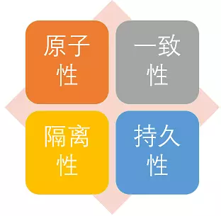

Hello everyone, I am Guide, and the analysis and summary of the **Spring transaction** that I promised readers in the previous paragraph is finally here. This part of the content is more important, whether it is for work or interview, but there are fewer good reference materials on the Internet.

If there is anything wrong with this article or need to be improved, please help me to point it out! Guide is grateful!

## 1. What is a transaction?

**A transaction is a logical set of operations, either all of them are executed or none of them are executed.**

_Brother Guide: Everyone should be able to recite the above sentence. Let me talk about it in combination with our daily real development._

Each business method of our system may include multiple atomic database operations. For example, there are two atomic database operations in the following `savePerson()` method. These atomic database operations are dependent, and they are either executed or not executed.

```java
	public void savePerson() {
		personDao.save(person);
		personDetailDao.save(personDetail);
	}
```

In addition, you need to pay special attention to: **Whether the transaction can take effect is the key to whether the database engine supports transactions. For example, commonly used MySQL databases use the `innodb` engine that supports transactions by default. However, if you change the database engine to `myisam`, the program no longer supports transactions!**

The most classic transaction is often cited as an example of transfer. If Xiao Ming wants to transfer 1,000 yuan to Xiaohong, this transfer will involve two key operations:

1. Reduce Xiao Ming's balance by 1,000 yuan

2. Increase Xiaohong's balance by 1,000 yuan.

In case there is a sudden error between these two operations, such as a banking system crash or a network failure, which causes Xiaoming's balance to decrease but Xiaohong's balance does not increase, this would be wrong. The transaction is to ensure that these two key operations either succeed or both fail.

```java
public class OrdersService {
	private AccountDao accountDao;

	public void setOrdersDao(AccountDao accountDao) {
		this.accountDao = accountDao;
	}

  @Transactional(propagation = Propagation.REQUIRED,
                isolation = Isolation.DEFAULT, readOnly = false, timeout = -1)
	public void accountMoney() {
    //1000 more Xiaohong accounts
		accountDao.addMoney(1000,xiaohong);
		//Simulate sudden anomalies, such as sudden power outages in the bank, etc.
    //If transaction management is not configured, it will result in that Xiaohong’s account has more than 1000 and Xiaoming’s account has no less money.
		int i = 10 / 0;
		//Xiao Wang account less 1000
		accountDao.reduceMoney(1000,xiaoming);
	}
}
```

In addition, the four ACID characteristics of database transactions are the basis of transactions. Let's briefly understand them below.

## 2. Do you understand the characteristics of transactions (ACID)?



- **Atomicity:** All operations in a transaction, or all of them are completed, or none of them, will not end in an intermediate link. If an error occurs during the execution of the transaction, it will be rolled back (Rollback) to the state before the transaction started, as if the transaction had never been executed. That is, transactions are indivisible and irreducible.
- **Consistency:** Before the start of the transaction and after the end of the transaction, the integrity of the database has not been destroyed. This means that the written data must fully comply with all preset constraints, triggers, cascading rollbacks, etc.
- **Isolation:** The database allows multiple concurrent transactions to read, write and modify its data at the same time. Isolation can prevent data inconsistencies caused by cross execution when multiple transactions are executed concurrently. Transaction isolation is divided into different levels, including read uncommitted, read committed, repeatable read, and serializable.
- **Durability:** After the transaction is completed, the modification of the data is permanent and will not be lost even if the system fails.

Reference: [https://zh.wikipedia.org/wiki/ACID](https://zh.wikipedia.org/wiki/ACID) 。

## 3. Talk in detail about Spring's support for transactions

**One more reminder: Whether your program supports transactions depends first on the database. For example, if you use MySQL, if you choose the innodb engine, then congratulations, you can support transactions. However, if your MySQL database uses the myisam engine, I am sorry, it does not support transactions from the root.**

Here is one more important point of knowledge: **How does MySQL guarantee atomicity?**

We know that if we want to ensure the atomicity of transactions, we need to **roll back** the operations that have been performed when an exception occurs. In MySQL, the recovery mechanism is through **undo log** realized, all the changes made by the transaction will be recorded in this rollback log first, and then the related operations will be executed. If an exception is encountered during execution, we can directly use the information in the **rollback log** to roll back the data to the way it was before the modification! In addition, the rollback log will be persisted to disk before the data. This ensures that even if the database is suddenly down, when the user starts the database again, the database can also roll back the previously unfinished transactions by querying the rollback log.

### 3.1. Spring supports two ways of transaction management

#### 1. Programmatic transaction management

Manual transaction management through `TransactionTemplate` or `TransactionManager` is rarely used in practical applications, but it is helpful for you to understand Spring transaction management principles.

The sample code for programmatic transaction management using `TransactionTemplate` is as follows:

```java
@Autowired
private TransactionTemplate transactionTemplate;
public void testTransaction() {

        transactionTemplate.execute(new TransactionCallbackWithoutResult() {
            @Override
            protected void doInTransactionWithoutResult(TransactionStatus transactionStatus) {

                try {

                    // ....  Business code
                } catch (Exception e){
                    //Rollback
                    transactionStatus.setRollbackOnly();
                }

            }
        });
}
```

The sample code for programmatic transaction management using `TransactionManager` is as follows:

```java
@Autowired
private PlatformTransactionManager transactionManager;

public void testTransaction() {

  TransactionStatus status = transactionManager.getTransaction(new DefaultTransactionDefinition());
          try {
               // ....  Business code
              transactionManager.commit(status);
          } catch (Exception e) {
              transactionManager.rollback(status);
          }
}
```

#### 2. Declarative transaction management

It is recommended to use (the code is least intrusive), and it is actually implemented through AOP (the full annotation method based on `@Transactional` is most used).

The sample code for transaction management using `@Transactional` annotation is as follows:

```java
@Transactional(propagation=propagation.PROPAGATION_REQUIRED)
public void aMethod {
  //do something
  B b = new B();
  C c = new C();
  b.bMethod();
  c.cMethod();
}
```

### 3.2. Introduction to Spring transaction management interface

In the Spring framework, the three most important interfaces related to transaction management are as follows:

- **`PlatformTransactionManager`**： (Platform) Transaction manager, the core of Spring transaction strategy.
- **`TransactionDefinition`**： Transaction definition information (transaction isolation level, propagation behavior, timeout, read-only, rollback rules).
- **`TransactionStatus`**： Transaction running status.

We can think of the **`PlatformTransactionManager`** interface as the upper-level manager of the transaction, while the two interfaces **`TransactionDefinition`** and **`TransactionStatus`** can be regarded as the description of the transaction.

**`PlatformTransactionManager`** will perform transaction management according to the definition of **`TransactionDefinition`**, such as transaction timeout, isolation level, propagation behavior, etc., while the **`TransactionStatus`** interface provides some methods to obtain the corresponding status of the transaction, such as whether it is a new transaction, whether it can be rolled back, and so on.
#### 3.2.1. PlatformTransactionManager:事务管理接口

**Spring 并不直接管理事务，而是提供了多种事务管理器** 。Spring 事务管理器的接口是： **`PlatformTransactionManager`** 。

通过这个接口，Spring 为各个平台如 JDBC(`DataSourceTransactionManager`)、Hibernate(`HibernateTransactionManager`)、JPA(`JpaTransactionManager`)等都提供了对应的事务管理器，但是具体的实现就是各个平台自己的事情了。

**`PlatformTransactionManager` 接口的具体实现如下:**


`PlatformTransactionManager`接口中定义了三个方法：

```java
package org.springframework.transaction;

import org.springframework.lang.Nullable;

public interface PlatformTransactionManager {
    //获得事务
    TransactionStatus getTransaction(@Nullable TransactionDefinition var1) throws TransactionException;
    //提交事务
    void commit(TransactionStatus var1) throws TransactionException;
    //回滚事务
    void rollback(TransactionStatus var1) throws TransactionException;
}

```

**这里多插一嘴。为什么要定义或者说抽象出来`PlatformTransactionManager`这个接口呢？**

主要是因为要将事务管理行为抽象出来，然后不同的平台去实现它，这样我们可以保证提供给外部的行为不变，方便我们扩展。我前段时间分享过：**“为什么我们要用接口？”**


#### 3.2.2. TransactionDefinition:事务属性

事务管理器接口 **`PlatformTransactionManager`** 通过 **`getTransaction(TransactionDefinition definition)`** 方法来得到一个事务，这个方法里面的参数是 **`TransactionDefinition`** 类 ，这个类就定义了一些基本的事务属性。

那么什么是 **事务属性** 呢？

事务属性可以理解成事务的一些基本配置，描述了事务策略如何应用到方法上。

事务属性包含了 5 个方面：


`TransactionDefinition` 接口中定义了 5 个方法以及一些表示事务属性的常量比如隔离级别、传播行为等等。

```java
package org.springframework.transaction;

import org.springframework.lang.Nullable;

public interface TransactionDefinition {
    int PROPAGATION_REQUIRED = 0;
    int PROPAGATION_SUPPORTS = 1;
    int PROPAGATION_MANDATORY = 2;
    int PROPAGATION_REQUIRES_NEW = 3;
    int PROPAGATION_NOT_SUPPORTED = 4;
    int PROPAGATION_NEVER = 5;
    int PROPAGATION_NESTED = 6;
    int ISOLATION_DEFAULT = -1;
    int ISOLATION_READ_UNCOMMITTED = 1;
    int ISOLATION_READ_COMMITTED = 2;
    int ISOLATION_REPEATABLE_READ = 4;
    int ISOLATION_SERIALIZABLE = 8;
    int TIMEOUT_DEFAULT = -1;
    // 返回事务的传播行为，默认值为 REQUIRED。
    int getPropagationBehavior();
    //返回事务的隔离级别，默认值是 DEFAULT
    int getIsolationLevel();
    // 返回事务的超时时间，默认值为-1。如果超过该时间限制但事务还没有完成，则自动回滚事务。
    int getTimeout();
    // 返回是否为只读事务，默认值为 false
    boolean isReadOnly();

    @Nullable
    String getName();
}
```

#### 3.2.3. TransactionStatus:事务状态

`TransactionStatus`接口用来记录事务的状态 该接口定义了一组方法,用来获取或判断事务的相应状态信息。

`PlatformTransactionManager.getTransaction(…)`方法返回一个 `TransactionStatus` 对象。

**TransactionStatus 接口接口内容如下：**

```java
public interface TransactionStatus{
    boolean isNewTransaction(); // 是否是新的事务
    boolean hasSavepoint(); // 是否有恢复点
    void setRollbackOnly();  // 设置为只回滚
    boolean isRollbackOnly(); // 是否为只回滚
    boolean isCompleted; // 是否已完成
}
```

### 3.3. 事务属性详解

_实际业务开发中，大家一般都是使用 `@Transactional` 注解来开启事务，很多人并不清楚这个参数里面的参数是什么意思，有什么用。为了更好的在项目中使用事务管理，强烈推荐好好阅读一下下面的内容。_

#### 3.3.1. 事务传播行为

**事务传播行为是为了解决业务层方法之间互相调用的事务问题**。

当事务方法被另一个事务方法调用时，必须指定事务应该如何传播。例如：方法可能继续在现有事务中运行，也可能开启一个新事务，并在自己的事务中运行。

**举个例子！**

我们在 A 类的`aMethod（）`方法中调用了 B 类的 `bMethod()` 方法。这个时候就涉及到业务层方法之间互相调用的事务问题。如果我们的 `bMethod()`如果发生异常需要回滚，如何配置事务传播行为才能让 `aMethod()`也跟着回滚呢？这个时候就需要事务传播行为的知识了，如果你不知道的话一定要好好看一下。

```java
Class A {
    @Transactional(propagation=propagation.xxx)
    public void aMethod {
        //do something
        B b = new B();
        b.bMethod();
    }
}

Class B {
    @Transactional(propagation=propagation.xxx)
    public void bMethod {
       //do something
    }
}
```

在`TransactionDefinition`定义中包括了如下几个表示传播行为的常量：

```java
public interface TransactionDefinition {
    int PROPAGATION_REQUIRED = 0;
    int PROPAGATION_SUPPORTS = 1;
    int PROPAGATION_MANDATORY = 2;
    int PROPAGATION_REQUIRES_NEW = 3;
    int PROPAGATION_NOT_SUPPORTED = 4;
    int PROPAGATION_NEVER = 5;
    int PROPAGATION_NESTED = 6;
    ......
}
```

不过如此，为了方便使用，Spring 会相应地定义了一个枚举类：`Propagation`

```java
package org.springframework.transaction.annotation;

import org.springframework.transaction.TransactionDefinition;

public enum Propagation {

	REQUIRED(TransactionDefinition.PROPAGATION_REQUIRED),

	SUPPORTS(TransactionDefinition.PROPAGATION_SUPPORTS),

	MANDATORY(TransactionDefinition.PROPAGATION_MANDATORY),

	REQUIRES_NEW(TransactionDefinition.PROPAGATION_REQUIRES_NEW),

	NOT_SUPPORTED(TransactionDefinition.PROPAGATION_NOT_SUPPORTED),

	NEVER(TransactionDefinition.PROPAGATION_NEVER),

	NESTED(TransactionDefinition.PROPAGATION_NESTED);


	private final int value;

	Propagation(int value) {
		this.value = value;
	}

	public int value() {
		return this.value;
	}

}

```

**正确的事务传播行为可能的值如下** ：

**1.`TransactionDefinition.PROPAGATION_REQUIRED`**

使用的最多的一个事务传播行为，我们平时经常使用的`@Transactional`注解默认使用就是这个事务传播行为。如果当前存在事务，则加入该事务；如果当前没有事务，则创建一个新的事务。也就是说：

1. 如果外部方法没有开启事务的话，`Propagation.REQUIRED`修饰的内部方法会新开启自己的事务，且开启的事务相互独立，互不干扰。
2. 如果外部方法开启事务并且被`Propagation.REQUIRED`的话，所有`Propagation.REQUIRED`修饰的内部方法和外部方法均属于同一事务 ，只要一个方法回滚，整个事务均回滚。

举个例子：如果我们上面的`aMethod()`和`bMethod()`使用的都是`PROPAGATION_REQUIRED`传播行为的话，两者使用的就是同一个事务，只要其中一个方法回滚，整个事务均回滚。

```java
Class A {
    @Transactional(propagation=propagation.PROPAGATION_REQUIRED)
    public void aMethod {
        //do something
        B b = new B();
        b.bMethod();
    }
}

Class B {
    @Transactional(propagation=propagation.PROPAGATION_REQUIRED)
    public void bMethod {
       //do something
    }
}
```

**`2.TransactionDefinition.PROPAGATION_REQUIRES_NEW`**

创建一个新的事务，如果当前存在事务，则把当前事务挂起。也就是说不管外部方法是否开启事务，`Propagation.REQUIRES_NEW`修饰的内部方法会新开启自己的事务，且开启的事务相互独立，互不干扰。

举个例子：如果我们上面的`bMethod()`使用`PROPAGATION_REQUIRES_NEW`事务传播行为修饰，`aMethod`还是用`PROPAGATION_REQUIRED`修饰的话。如果`aMethod()`发生异常回滚，`bMethod()`不会跟着回滚，因为 `bMethod()`开启了独立的事务。但是，如果 `bMethod()`抛出了未被捕获的异常并且这个异常满足事务回滚规则的话,`aMethod()`同样也会回滚，因为这个异常被 `aMethod()`的事务管理机制检测到了。

```java
Class A {
    @Transactional(propagation=propagation.PROPAGATION_REQUIRED)
    public void aMethod {
        //do something
        B b = new B();
        b.bMethod();
    }
}

Class B {
    @Transactional(propagation=propagation.REQUIRES_NEW)
    public void bMethod {
       //do something
    }
}
```

**3.`TransactionDefinition.PROPAGATION_NESTED`**:

如果当前存在事务，则创建一个事务作为当前事务的嵌套事务来运行；如果当前没有事务，则该取值等价于`TransactionDefinition.PROPAGATION_REQUIRED`。也就是说：

1. 在外部方法未开启事务的情况下`Propagation.NESTED`和`Propagation.REQUIRED`作用相同，修饰的内部方法都会新开启自己的事务，且开启的事务相互独立，互不干扰。
2. 如果外部方法开启事务的话，`Propagation.NESTED`修饰的内部方法属于外部事务的子事务，外部主事务回滚的话，子事务也会回滚，而内部子事务可以单独回滚而不影响外部主事务和其他子事务。

这里还是简单举个例子：

如果 `aMethod()` 回滚的话，`bMethod()`和`bMethod2()`都要回滚，而`bMethod()`回滚的话，并不会造成 `aMethod()` 和`bMethod()2`回滚。

```java
Class A {
    @Transactional(propagation=propagation.PROPAGATION_REQUIRED)
    public void aMethod {
        //do something
        B b = new B();
        b.bMethod();
        b.bMethod2();
    }
}

Class B {
    @Transactional(propagation=propagation.PROPAGATION_NESTED)
    public void bMethod {
       //do something
    }
    @Transactional(propagation=propagation.PROPAGATION_NESTED)
    public void bMethod2 {
       //do something
    }
}
```

**4.`TransactionDefinition.PROPAGATION_MANDATORY`**

如果当前存在事务，则加入该事务；如果当前没有事务，则抛出异常。（mandatory：强制性）

这个使用的很少，就不举例子来说了。

**若是错误的配置以下 3 种事务传播行为，事务将不会发生回滚，这里不对照案例讲解了，使用的很少。**

- **`TransactionDefinition.PROPAGATION_SUPPORTS`**: 如果当前存在事务，则加入该事务；如果当前没有事务，则以非事务的方式继续运行。
- **`TransactionDefinition.PROPAGATION_NOT_SUPPORTED`**: 以非事务方式运行，如果当前存在事务，则把当前事务挂起。
- **`TransactionDefinition.PROPAGATION_NEVER`**: 以非事务方式运行，如果当前存在事务，则抛出异常。

更多关于事务传播行为的内容请看这篇文章：[《太难了~面试官让我结合案例讲讲自己对 Spring 事务传播行为的理解。》](http://mp.weixin.qq.com/s?__biz=Mzg2OTA0Njk0OA==&mid=2247486668&idx=2&sn=0381e8c836442f46bdc5367170234abb&chksm=cea24307f9d5ca11c96943b3ccfa1fc70dc97dd87d9c540388581f8fe6d805ff548dff5f6b5b&token=1776990505&lang=zh_CN#rd)

#### 3.3.2 事务隔离级别

`TransactionDefinition` 接口中定义了五个表示隔离级别的常量：

```java
public interface TransactionDefinition {
    ......
    int ISOLATION_DEFAULT = -1;
    int ISOLATION_READ_UNCOMMITTED = 1;
    int ISOLATION_READ_COMMITTED = 2;
    int ISOLATION_REPEATABLE_READ = 4;
    int ISOLATION_SERIALIZABLE = 8;
    ......
}
```

和事务传播行为这块一样，为了方便使用，Spring 也相应地定义了一个枚举类：`Isolation`

```java
public enum Isolation {

	DEFAULT(TransactionDefinition.ISOLATION_DEFAULT),

	READ_UNCOMMITTED(TransactionDefinition.ISOLATION_READ_UNCOMMITTED),

	READ_COMMITTED(TransactionDefinition.ISOLATION_READ_COMMITTED),

	REPEATABLE_READ(TransactionDefinition.ISOLATION_REPEATABLE_READ),

	SERIALIZABLE(TransactionDefinition.ISOLATION_SERIALIZABLE);

	private final int value;

	Isolation(int value) {
		this.value = value;
	}

	public int value() {
		return this.value;
	}

}
```

下面我依次对每一种事务隔离级别进行介绍：

- **`TransactionDefinition.ISOLATION_DEFAULT`** :使用后端数据库默认的隔离级别，MySQL 默认采用的 `REPEATABLE_READ` 隔离级别 Oracle 默认采用的 `READ_COMMITTED` 隔离级别.
- **`TransactionDefinition.ISOLATION_READ_UNCOMMITTED`** :最低的隔离级别，使用这个隔离级别很少，因为它允许读取尚未提交的数据变更，**可能会导致脏读、幻读或不可重复读**
- **`TransactionDefinition.ISOLATION_READ_COMMITTED`** : 允许读取并发事务已经提交的数据，**可以阻止脏读，但是幻读或不可重复读仍有可能发生**
- **`TransactionDefinition.ISOLATION_REPEATABLE_READ`** : 对同一字段的多次读取结果都是一致的，除非数据是被本身事务自己所修改，**可以阻止脏读和不可重复读，但幻读仍有可能发生。**
- **`TransactionDefinition.ISOLATION_SERIALIZABLE`** : 最高的隔离级别，完全服从 ACID 的隔离级别。所有的事务依次逐个执行，这样事务之间就完全不可能产生干扰，也就是说，**该级别可以防止脏读、不可重复读以及幻读**。但是这将严重影响程序的性能。通常情况下也不会用到该级别。

因为平时使用 MySQL 数据库比较多，这里再多提一嘴！

MySQL InnoDB 存储引擎的默认支持的隔离级别是 **`REPEATABLE-READ`（可重读）**。我们可以通过`SELECT @@tx_isolation;`命令来查看，MySQL 8.0 该命令改为`SELECT @@transaction_isolation;`：

```
mysql> SELECT @@tx_isolation;
+-----------------+
| @@tx_isolation  |
+-----------------+
| REPEATABLE-READ |
+-----------------+
```

这里需要注意的是：与 SQL 标准不同的地方在于 InnoDB 存储引擎在 **`REPEATABLE-READ`（可重读）** 事务隔离级别下使用的是 Next-Key Lock 锁算法，因此可以避免幻读的产生，这与其他数据库系统(如 SQL Server)是不同的。所以说 InnoDB 存储引擎的默认支持的隔离级别是 **`REPEATABLE-READ`（可重读）** 已经可以完全保证事务的隔离性要求，即达到了 SQL 标准的 **`SERIALIZABLE`(可串行化)** 隔离级别。

因为隔离级别越低，事务请求的锁越少，所以大部分数据库系统的隔离级别都是 **`READ-COMMITTED`(读取提交内容)** :，但是你要知道的是 InnoDB 存储引擎默认使用 **`REPEATABLE-READ`（可重读）** 并不会什么任何性能上的损失。

更多关于事务隔离级别的内容请看：

1. [《一文带你轻松搞懂事务隔离级别(图文详解)》](https://mp.weixin.qq.com/s?__biz=Mzg2OTA0Njk0OA==&mid=2247485085&idx=1&sn=01e5c29c49f32886bc897af7632b34ba&chksm=cea24956f9d5c040a07e4d335219f11f888a2d32444c16cade3f69c294ae0a1e416bcd221fb6&token=1613452699&lang=zh_CN&scene=21#wechat_redirect)
2. [面试官：你说对 MySQL 事务很熟？那我问你 10 个问题](https://mp.weixin.qq.com/s?__biz=Mzg2OTA0Njk0OA==&mid=2247486625&idx=2&sn=e235dab2757739438b8f33d205a9327f&chksm=cea2436af9d5ca7c9a1a8db9d020f71205687beca23ac958f9c9a711ee0185cab30173ad2b1a&token=1776990505&lang=zh_CN#rd)

#### 3.3.3. 事务超时属性

所谓事务超时，就是指一个事务所允许执行的最长时间，如果超过该时间限制但事务还没有完成，则自动回滚事务。在 `TransactionDefinition` 中以 int 的值来表示超时时间，其单位是秒，默认值为-1。

#### 3.3.3. 事务只读属性

```java
package org.springframework.transaction;

import org.springframework.lang.Nullable;

public interface TransactionDefinition {
    ......
    // 返回是否为只读事务，默认值为 false
    boolean isReadOnly();

}
```

对于只有读取数据查询的事务，可以指定事务类型为 readonly，即只读事务。只读事务不涉及数据的修改，数据库会提供一些优化手段，适合用在有多条数据库查询操作的方法中。

很多人就会疑问了，为什么我一个数据查询操作还要启用事务支持呢？

拿 MySQL 的 innodb 举例子，根据官网 [https://dev.mysql.com/doc/refman/5.7/en/innodb-autocommit-commit-rollback.html](https://dev.mysql.com/doc/refman/5.7/en/innodb-autocommit-commit-rollback.html) 描述：

> MySQL 默认对每一个新建立的连接都启用了`autocommit`模式。在该模式下，每一个发送到 MySQL 服务器的`sql`语句都会在一个单独的事务中进行处理，执行结束后会自动提交事务，并开启一个新的事务。

但是，如果你给方法加上了`Transactional`注解的话，这个方法执行的所有`sql`会被放在一个事务中。如果声明了只读事务的话，数据库就会去优化它的执行，并不会带来其他的什么收益。

如果不加`Transactional`，每条`sql`会开启一个单独的事务，中间被其它事务改了数据，都会实时读取到最新值。

分享一下关于事务只读属性，其他人的解答：

1. 如果你一次执行单条查询语句，则没有必要启用事务支持，数据库默认支持 SQL 执行期间的读一致性；
2. 如果你一次执行多条查询语句，例如统计查询，报表查询，在这种场景下，多条查询 SQL 必须保证整体的读一致性，否则，在前条 SQL 查询之后，后条 SQL 查询之前，数据被其他用户改变，则该次整体的统计查询将会出现读数据不一致的状态，此时，应该启用事务支持

#### 3.3.4. 事务回滚规则

这些规则定义了哪些异常会导致事务回滚而哪些不会。默认情况下，事务只有遇到运行期异常（RuntimeException 的子类）时才会回滚，Error 也会导致事务回滚，但是，在遇到检查型（Checked）异常时不会回滚。


如果你想要回滚你定义的特定的异常类型的话，可以这样：

```java
@Transactional(rollbackFor= MyException.class)
```

### 3.4. @Transactional 注解使用详解

#### 1) `@Transactional` 的作用范围

1. **方法** ：推荐将注解使用于方法上，不过需要注意的是：**该注解只能应用到 public 方法上，否则不生效。**
2. **类** ：如果这个注解使用在类上的话，表明该注解对该类中所有的 public 方法都生效。
3. **接口** ：不推荐在接口上使用。

#### 2) `@Transactional` 的常用配置参数

`@Transactional`注解源码如下，里面包含了基本事务属性的配置：

```java
@Target({ElementType.TYPE, ElementType.METHOD})
@Retention(RetentionPolicy.RUNTIME)
@Inherited
@Documented
public @interface Transactional {

	@AliasFor("transactionManager")
	String value() default "";

	@AliasFor("value")
	String transactionManager() default "";

	Propagation propagation() default Propagation.REQUIRED;

	Isolation isolation() default Isolation.DEFAULT;

	int timeout() default TransactionDefinition.TIMEOUT_DEFAULT;

	boolean readOnly() default false;

	Class<? extends Throwable>[] rollbackFor() default {};

	String[] rollbackForClassName() default {};

	Class<? extends Throwable>[] noRollbackFor() default {};

	String[] noRollbackForClassName() default {};

}
```

**`@Transactional` 的常用配置参数总结（只列巨额 5 个我平时比较常用的）：**

| 属性名      | 说明                                                                                         |
| :---------- | :------------------------------------------------------------------------------------------- |
| propagation | 事务的传播行为，默认值为 REQUIRED，可选的值在上面介绍过                                      |
| isolation   | 事务的隔离级别，默认值采用 DEFAULT，可选的值在上面介绍过                                     |
| timeout     | 事务的超时时间，默认值为-1（不会超时）。如果超过该时间限制但事务还没有完成，则自动回滚事务。 |
| readOnly    | 指定事务是否为只读事务，默认值为 false。                                                     |
| rollbackFor | 用于指定能够触发事务回滚的异常类型，并且可以指定多个异常类型。                               |

#### 3)`@Transactional` 事务注解原理

面试中在问 AOP 的时候可能会被问到的一个问题。简单说下吧！

我们知道，**`@Transactional` 的工作机制是基于 AOP 实现的，AOP 又是使用动态代理实现的。如果目标对象实现了接口，默认情况下会采用 JDK 的动态代理，如果目标对象没有实现了接口,会使用 CGLIB 动态代理。**

多提一嘴：`createAopProxy()` 方法 决定了是使用 JDK 还是 Cglib 来做动态代理，源码如下：

```java
public class DefaultAopProxyFactory implements AopProxyFactory, Serializable {

	@Override
	public AopProxy createAopProxy(AdvisedSupport config) throws AopConfigException {
		if (config.isOptimize() || config.isProxyTargetClass() || hasNoUserSuppliedProxyInterfaces(config)) {
			Class<?> targetClass = config.getTargetClass();
			if (targetClass == null) {
				throw new AopConfigException("TargetSource cannot determine target class: " +
						"Either an interface or a target is required for proxy creation.");
			}
			if (targetClass.isInterface() || Proxy.isProxyClass(targetClass)) {
				return new JdkDynamicAopProxy(config);
			}
			return new ObjenesisCglibAopProxy(config);
		}
		else {
			return new JdkDynamicAopProxy(config);
		}
	}
  .......
}
```

如果一个类或者一个类中的 public 方法上被标注`@Transactional` 注解的话，Spring 容器就会在启动的时候为其创建一个代理类，在调用被`@Transactional` 注解的 public 方法的时候，实际调用的是，`TransactionInterceptor` 类中的 `invoke()`方法。这个方法的作用就是在目标方法之前开启事务，方法执行过程中如果遇到异常的时候回滚事务，方法调用完成之后提交事务。

> `TransactionInterceptor` 类中的 `invoke()`方法内部实际调用的是 `TransactionAspectSupport` 类的 `invokeWithinTransaction()`方法。由于新版本的 Spring 对这部分重写很大，而且用到了很多响应式编程的知识，这里就不列源码了。

#### 4)Spring AOP 自调用问题

若同一类中的其他没有 `@Transactional` 注解的方法内部调用有 `@Transactional` 注解的方法，有`@Transactional` 注解的方法的事务会失效。

这是由于`Spring AOP`代理的原因造成的，因为只有当 `@Transactional` 注解的方法在类以外被调用的时候，Spring 事务管理才生效。

`MyService` 类中的`method1()`调用`method2()`就会导致`method2()`的事务失效。

```java
@Service
public class MyService {

private void method1() {
     method2();
     //......
}
@Transactional
 public void method2() {
     //......
  }
}
```

解决办法就是避免同一类中自调用或者使用 AspectJ 取代 Spring AOP 代理。

#### 5) `@Transactional` 的使用注意事项总结

1.  `@Transactional` 注解只有作用到 public 方法上事务才生效，不推荐在接口上使用；
2.  避免同一个类中调用 `@Transactional` 注解的方法，这样会导致事务失效；
3.  正确的设置 `@Transactional` 的 rollbackFor 和 propagation 属性，否则事务可能会回滚失败
4.  ......

## 4. Reference

3. [总结]Spring 事务管理中@Transactional 的参数:[http://www.mobabel.net/spring 事务管理中 transactional 的参数/](http://www.mobabel.net/spring事务管理中transactional的参数/)
4. Spring 官方文档：[https://docs.spring.io/spring/docs/4.2.x/spring-framework-reference/html/transaction.html](https://docs.spring.io/spring/docs/4.2.x/spring-framework-reference/html/transaction.html)
5. 《Spring5 高级编程》
6. 透彻的掌握 Spring 中@transactional 的使用: [https://www.ibm.com/developerworks/cn/java/j-master-spring-transactional-use/index.html](https://www.ibm.com/developerworks/cn/java/j-master-spring-transactional-use/index.html)
7. Spring 事务的传播特性：[https://github.com/love-somnus/Spring/wiki/Spring 事务的传播特性](https://github.com/love-somnus/Spring/wiki/Spring事务的传播特性)
8. [Spring 事务传播行为详解](https://segmentfault.com/a/1190000013341344) ：[https://segmentfault.com/a/1190000013341344](https://segmentfault.com/a/1190000013341344)
9. 全面分析 Spring 的编程式事务管理及声明式事务管理：[https://www.ibm.com/developerworks/cn/education/opensource/os-cn-spring-trans/index.html](https://www.ibm.com/developerworks/cn/education/opensource/os-cn-spring-trans/index.html)